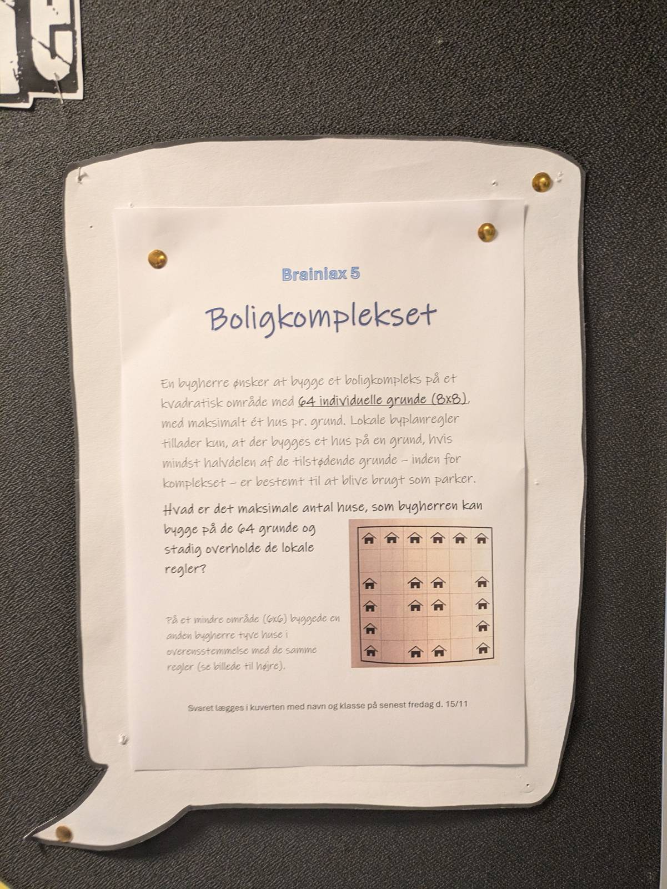

# Boligkomplekset

En bygherre ønsker at bygge et boligkompleks på et kvadratisk omrøde med **64 individuelle grunde (8x8)**, med maksimalt ét hus pr. grund. Lokale byplanregler tillader kun, at der bygges et hus på en grund, hvis mindst halvdelen af de tilstødende grunde - inde for komplekset - er bestemt til at blive brugt som parker.

**Hvad er det maksimale antal huse, som bygherren kan bygge på de 64 grunde og stadig overholde de lokale regler?**

På et mindre område (6x6) byggede en anden bygherre tyve huse i overenstemmelse med de samme regler (se billede til højre).